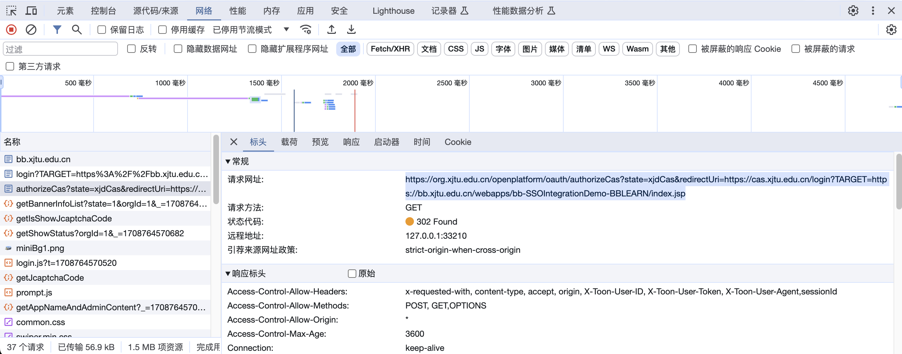

---
authors:
  - yan_xiaoo
date: 2024-02-24
categories:
  - 自动化
  - requests
readtime: 15
comments: true
---

# 西安交通大学登录系统自动化


西安交通大学登录系统就是在访问 [ehall 教务系统](https://ehall.xjtu.edu.cn)，[思源学堂](https://bb.xjtu.edu.cn) 等需要登录的西交网站时弹出来的“统一身份认证”登录的界面。具体来说，要完成登录，至少要进行如下的网络请求步骤：

1. 请求待登录网站跳转到登录界面所用的网址（因为这个网址包含了必须的 AppID 和登录后重定向到的网址的信息）
2. 检查是否需要填写验证码。如果需要填写验证码，则请求验证码接口
3. 发起登录请求
4. 请求用户身份，获得用户编号（一般就是学号）和用户类型的信息
5. 利用刚获取的用户编号，请求重定向网址信息。重定向网址中一般会包含一个 oauth_code 之类的参数告诉目标网站你是谁
6. 向重定向网址发起请求并保存网站返回的 cookie

完成这些步骤之后，就可以利用待登录网站给予的 cookie 爬取需要登录才能获得的信息了。

<!-- more -->

西交登录界面的登录逻辑位于 login.js 中，编码风格还可以，有些注释。如果有不清楚的地方，可以打开登录页面后在开发者工具中寻找 login.js，自行阅读其代码。

第一步的网址需要利用开发者工具，在网站点击「登录」按钮之后观察网站跳转时发起的网络请求，找到一个类似于 `https://org.xjtu.edu.cn/openplatform/oauth/...` 且后面包含类似 `redirectUrl=...` 或者 `appid=...` 之类的网址。比如，思源学堂跳转登录的网址如下：

```http
https://org.xjtu.edu.cn/openplatform/oauth/authorizeCas?state=xjdCas&redirectUri=https://cas.xjtu.edu.cn/login?TARGET=https://bb.xjtu.edu.cn/webapps/bb-SSOIntegrationDemo-BBLEARN/index.jsp
```



## 接口具体介绍

接下来，我会介绍登录时需要请求的几个接口的详细信息，以及如何利用 Python 的 requests 库完成自动登录的过程。如果你还不太了解 requests 请求的部分，可以看一看下面的简单介绍：

http 请求包含 `GET`, `POST`, `PUT`,`DELETE` 等方法，其中最常用的是 `GET` 和 `POST`。它们分别可以用 `requests.get` 和 `requests.post` 方法发起。不过，由于登录过程中需要存储网站返回的 cookie，强烈建议使用 `requests.Session` 类。这个类同样拥有 `get` 和 `post` 方法，而且它会自动存储请求过程中网站返回的所有 cookie。

一个典型的 requests 请求如下：

```python
headers = {...}
params = {...}
data = {...}
requests.post(headers=headers, params=params, data=data)
```

requests 请求的数据可以在如下几个部分：参数(params)，数据(data)，标头(headers)。一般来说，params 中的数据会被 requests 最终放到请求 URL 里头；比如：

```python
params = {"a": "abc", "appid": "100"}
requests.get("http://example.org/hello", params=params)
```

实际上访问了：

```http
http://example.org/hello?a=abc&appid=100
```

这个网址。

data 中的内容不会在请求的网址中呈现。它会显示在开发者工具的「请求负载」一栏；headers 中的内容就在请求标头里，可以在开发者工具的「标头」一栏查看到。

大部分西交的登录接口不需要 headers 和 params，只需要 data 传输数据。不过，为了安全起见，建议在请求的时候更改 headers 中的 User Agent。比如：

```python
session = requests.Session()
session.headers.update({"User-Agent": "Mozilla/5.0 (Windows NT 10.0; Win64; x64) AppleWebKit/537.36 (KHTML, like Gecko) Chrome/116.0.0.0 Safari/537.36"})
```

这样设置之后，`session` 访问所有网址时都会更换自己的 UA 为上面这个，可以绕过一些简陋的爬虫检测（用 requests 默认的 UA 实在是太不像样了）

> Python 有一个 fake-useragent 库集合了一大堆 User-Agent，可以自行搜索。

### 获取是否需要验证码

接口地址: 

```http
https://org.xjtu.edu.cn/openplatform/g/admin/getIsShowJcaptchaCode
```

接口方法：`POST`

Cookie 要求：啥都不用

Headers 要求：`Content-Type=application/json;charset=UTF-8`

传入字段：`userName`，内容为用户名（手机号/学号）

注意：实际要发送的字段是一个利用 json 转换为字符串的字典。详情见下方势力。

返回值：json，实例如下:

```json
{"code":0,"message":"成功","data":false}
```

`code`：表示请求是否成功，成功是 0 

`message`：请求失败的原因。成功的时候就是「成功」

`data`：是否需要显示验证码，布尔值

#### 调用实例

> 以下的所有实例中，都假设代码已经包含了这两句：
>
> `session = requests.Session()`
>
> `session.headers.update({"User-Agent": "Mozilla/5.0 (Windows NT 10.0; Win64; x64) AppleWebKit/537.36 (KHTML, like Gecko) Chrome/116.0.0.0 Safari/537.36"})`

```python
import json


response = session.post(headers={"Content-Type":"application/json;charset=UTF-8"}, data=json.dumps{"userName": "你的用户名"})
result = response.json()
if result['code'] == 0:
    print("成功请求是否需要验证码")
    if result['data']:
        print("需要填写验证码")
    else:
        print("不需要填写验证码")
else:
    print("请求失败：", result['message'])
```

#### 注意事项

- 根据网站的源码显示，登录接口用户名和密码错误三次之后需要填写验证码。因此，如果是第一次尝试登录，也可以不请求这个接口，直接认为不需要填写验证码

- 在没有被限制之前，登录接口的验证码字段留空就行；错误三次后，登录接口必须填写验证码字段，否则会出现如下错误：

  ```json
  {'code': -1, 'message': '图形验证码不能为空(Graphic verification code cannot be empty)', 'data': None}
  ```

### 获取验证码

如果通过调用上一个接口发现需要获取验证码，就需要使用本接口。

接口地址：

```http
https://org.xjtu.edu.cn/openplatform/g/admin/getJcaptchaCode
```

接口方法：`POST`

Headers: `Content-Type=application/json;charset=UTF-8`

Cookie 要求：不需要

传入字段：不需要传入数据

返回值：json，内容基本如下：

```json
{
    "code": 0,
    "message": "成功",
    "data": "..."
}
```

`code`：表示请求是否成功，成功是 0 

`message`：请求失败的原因。成功的时候就是「成功」

`data`：验证码的内容。是一个字符串，其内容为 base64 编码后的一张 png 格式图片。

#### 调用实例

```python
import base64


response = session.post(
        'https://org.xjtu.edu.cn/openplatform/g/admin/getJcaptchaCode',
        headers={
            'Content-Type': 'application/json;charset=UTF-8'
        }
    )
data = response.json()
# Base64 解码图片，然后按二进制写入一个文件中
img = base64.b64decode(data['data'])
with open('captcha.png', 'wb') as file:
    file.write(img)
print('downloader captcha to captcha.png')
```

### 登录接口

接口地址：

```http
https://org.xjtu.edu.cn/openplatform/g/admin/login
```

请求方法：`POST`

Header：`Content-Type=application/json;charset=utf-8`

Cookie: 没有要求

传入字段：

- `loginType`：不知道是啥，固定传入 "1" 即可
- `username`：登录的用户名
- `pwd`：AES 加密后的密码
- `jcaptchaCode`：验证码。当获取验证码接口返回“不需要验证码”的时候，此字段留空即可；否则，传入字符串类型的验证码

请注意实际传入的内容是上述字典被 json 转换为字符串之后的结果。详情请见下方实例。

返回值：json，实例如下：

```json
{
    "code": 0,
    "message": "成功",
    "data": {
        "pwdState": "2",
        "tokenKey": "user_token_..."
        "orgInfo": {
            "logo": null,
            "orgId": 1000,
            "orgName": "西安交通大学",
            "memberId": ...(整数）,
            "firstLogin": 2,
            "isIdentification": 1,
            "memberName": null,
            "addNew": 2
        },
        "state": "xjdCas"
    }
}
```

`code`：表示请求是否成功，成功是 0 

`message`：请求失败的原因。成功的时候就是「成功」

`data`：实际包含内容的字段

`pwdState`：密码是不是弱密码。是的话就是 2，不是的话不知道。

`tokenKey`：一段十六进制的长数字，以 `user_token_` 开头。此内容比较重要

`orginfo`：登录到的组织的信息。其中的 `memberId` 为一个整数，在后面需要用到。

#### 注意事项

在接口中传入的 `pwd` 应当是 AES 的 ECB 方法加密之后的密码。AES 加密密钥为固定值：`0725@pwdorgopenp`。

在 Python 中，加密需要安装一个软件包 `pycryptodome`。

示例加密函数如下：

```python
from Crypto.Cipher import AES


def encrypt_passward(password: str) -> str:
    """
    传入一个明文密码，输出一个加密的密码
    """
    def pad(text):
        text_length = len(text)
        amount_to_pad = AES.block_size - (text_length % AES.block_size)
        if amount_to_pad == 0:
            amount_to_pad = AES.block_size
        padding = chr(amount_to_pad)
        return text + padding * amount_to_pad

    cipher = AES.new(
        PUBLIC_KEY.encode('utf-8'),
        AES.MODE_ECB
    )

    encrypted_data = cipher.encrypt(pad(password).encode('utf-8'))
    return str(base64.b64encode(encrypted_data), encoding='utf-8')
```

> 我其实挺疑惑为什么用 AES 的…AES 可加密可解密，而且加密解密密钥一样。它的加密密钥是公开的，这样的话任何人只要截获了你发送的登录数据，用这个密钥一解密就能拿到明文密码，基本没有安全性可言。
>
> 为什么不用 MD5 然后后端改为存储密码的 MD5 值呢？

#### 成功登录后设置 Cookie

如果调用上方登录接口成功，需要手动的保存两个返回值为 Cookie。Cookie 的网站范围和路径留作默认即可。

需要设置的 Cookie 的名称和内容如下：

`open_Platform_User`：设置为接口返回值 `data` 字段中 `tokenKey` 字段的值

`memberId`：设置为接口返回值中 `data` 字段中的 `orgInfo` 字段里的 `memberId` 的值

详细步骤见下方实例。

#### 调用实例

```python
from Crypto.Cipher import AES


def encrypt_passward(password: str) -> str:
    """
    传入一个明文密码，输出一个加密的密码
    """
    def pad(text):
        text_length = len(text)
        amount_to_pad = AES.block_size - (text_length % AES.block_size)
        if amount_to_pad == 0:
            amount_to_pad = AES.block_size
        padding = chr(amount_to_pad)
        return text + padding * amount_to_pad

    cipher = AES.new(
        PUBLIC_KEY.encode('utf-8'),
        AES.MODE_ECB
    )

    encrypted_data = cipher.encrypt(pad(password).encode('utf-8'))
    return str(base64.b64encode(encrypted_data), encoding='utf-8')


login_headers = {"Content-Type": "application/json;charset=utf-8"}
login_data = {"loginType": 1,
              "username": username, # 换成你的用户名
              "pwd": encrypt_passward(password), # 换成你的密码
              "jcaptchaCode": ""} # 假定不需要输入验证码
result = session.post("https://org.xjtu.edu.cn/openplatform/g/admin/login", headers=login_headers,
                      data=json.dumps(login_data))
result_json = result.json()
if result_json["code"] == 0:
    print("登录成功")
    # 获取最关键的两个返回值；这两个值后边的接口需要使用
    # 把这两个内容保存为 Cookie
    open_Platform_User = str(result_json["data"]["tokenKey"])
    # 手动设置 Cookie
    session.cookies.set("open_Platform_User", open_Platform_User)
    memberId = str(result_json["data"]["orgInfo"]["memberId"])
    session.cookies.set("memberId", memberId)
else:
    print("登录失败:", result_json["message"])
```

### 获取用户身份接口

> 「获取用户身份」是我根据函数名称 getUserIdentity 直接翻译的

接口地址：

```http
https://org.xjtu.edu.cn/openplatform/g/admin/getUserIdentity
```

请求方法：`POST`

Header：`Content-Type=application/x-www-form-urlencoded;charset=utf-8`

Cookie：必须已经手动设置了 `open_Platform_User` 和 `memberId` 两个 Cookie。

此接口需要在登录接口成功后调用。

传入字段：`memberId`：登录接口中的那个 memberId 的值

请注意：此接口直接传入一个字典即可，不需要传入 json 转换字典得到的字符串。

返回值：json，实例如下：

```json
{
    "code": 0,
    "message": "成功",
    "data": [
        {
            "personNo": "...",
            "userType": 1,
            "payCard": "",
            "railwaystationstart": "",
            "railwaystationstartName": "",
            "railwaystation": "",
            "railwaystationName": "",
            "id": null
        }
    ]
}
```

`code`：表示请求是否成功，成功是 0 

`message`：请求失败的原因。成功的时候就是「成功」

`data`：实际包含内容的字段

`personNo`：用户的编号。一般就是你的学号

`userType`：用户的类型

其他字段完全没有用处。我真的不知道 `railwaystation` 这样的字段意义何在，西交里有火车站吗？

请保存 `personNo` 和 `userType` 两个字段的内容。它们在下一个接口的请求中会被用到。

#### 调用实例

```python
identity_headers = {"Content-Type": "application/x-www-form-urlencoded;charset=utf-8"}
identity_data = {"memberId": "..."} # 这里填入在登录接口获得的 memberId
result_identity = session.post("https://org.xjtu.edu.cn/openplatform/g/admin/getUserIdentity",
                               headers=identity_headers,
                               data=identity_data)
result_identity_json = result_identity.json()

if result_identity_json["code"] == 0:
    user_type = result_identity_json["data"][0]["userType"]
    print("用户类型:", user_type)
    person_no = result_identity_json["data"][0]["personNo"]
    print("用户编号:", person_no)
else:
    print("获取用户身份失败:", result_identity_json["message"])
```

### 获得重定向网址接口

登录成功后，网页一般会从登录页面跳转到你在登录前所在的页面。这一步的接口可以让你获取需要跳转到的网址。

接口地址：

```http
https://org.xjtu.edu.cn/openplatform/oauth/auth/getRedirectUrl
```

接口方法：`GET`（注意不是 POST 了）

Header：`Content-Type=application/json;charset=utf-8`

Cookie：必须已经手动设置登录接口那部分设置的两个 Cookie

建议在调用完登录接口和获得用户身份接口后调用本接口。

传入字段：无

参数（最终会拼接到 url 上）：

`userType`：获得用户身份接口得到的 `userType` 值

`personNo`：获得用户身份得到的 `personNo` 值

`_`: 当前时间戳，具体为 1970 年 1 月 1 日到现在的毫秒数。此时间戳可以用如下函数得到

```python
import time


def get_timestamp() -> int:
    return int(round(time.time() * 1000))
```

返回值：json，内容实例如下：

```json
{
    "code": 0,
    "message": "成功",
    "data": "https://cas.xjtu.edu.cn/login?TARGET=https://bb.xjtu.edu.cn/webapps/bb-SSOIntegrationDemo-BBLEARN/execute/authValidate/customLogout?returnUrl=https://bb.xjtu.edu.cn/&code=...&state=...&userType=...&employeeNo=..."
}
```

`code`：表示请求是否成功，成功是 0 

`message`：请求失败的原因。成功的时候就是「成功」

`data`：重定向 URL 。这里省去了一些敏感字段。

#### 调用实例

```python
import time


def get_timestamp() -> int:
    return int(round(time.time() * 1000))


redirect_headers = {"Content-Type": "application/json;charset=utf-8"}
redirect_data = {"userType": user_type,
                 "personNo": person_no,
                 "_": get_timestamp()}
result_redirect = session.get("https://org.xjtu.edu.cn/openplatform/oauth/auth/getRedirectUrl",
                              headers=redirect_headers,
                              params=redirect_data)
result_redirect_json = result_redirect.json()

if result_redirect_json["code"] == 0:
    print("重定向地址:", result_redirect_json["data"])
else:
    print("获取重定向地址失败:", result_redirect_json["message"])
```

#### 接下来做什么？

请求这个接口后，你已经完成了所有登录的步骤。接下来，只需要通过一个 `session` 请求重定向地址以便接受目标网站给你的 Cookie，然后直接去请求目标网站需要登录才能访问的内容就行了。比如：

```python
result_redirect = session.get("https://org.xjtu.edu.cn/openplatform/oauth/auth/getRedirectUrl",
                                  headers=redirect_headers,
                                  params=redirect_data)
    result_redirect_json = result_redirect.json()

    if result_redirect_json["code"] == 0:
        print("重定向地址:", result_redirect_json["data"])
        # get 一下重定向地址以便让目标网站给我们 Cookie
        session.get(result_redirect_json["data"])
        return session
```


## 完整的登录函数的实例

下面这个函数接受「触发登录的网址」，用户名和密码，并返回一个已经登录（拿到 Cookie）的 requests 中的 Session 对象。

```python
import requests
import base64
from crypto.Cipher import AES


def login(base_url: str, username: str, password: str):
    session = requests.Session()
    session.get(base_url)

    for cookie in session.cookies:
        print(cookie.name, ":", cookie.value)

    is_show_jcaptcha = session.post("https://org.xjtu.edu.cn/openplatform/g/admin/getIsShowJcaptchaCode",
                                    headers={'Content-Type': 'application/json;charset=UTF-8'},
                                    data=json.dumps({"userName": username}))
    is_show_jcaptcha_json = is_show_jcaptcha.json()
    print(is_show_jcaptcha_json)
    if is_show_jcaptcha_json["code"] == 0:
        print("是否显示验证码:", is_show_jcaptcha_json["data"])
    else:
        print("获取是否显示验证码失败:", is_show_jcaptcha_json["message"])
        return False

    login_headers = {"Content-Type": "application/json;charset=utf-8"}
    login_data = {"loginType": 1,
                  "username": username,
                  "pwd": encrypt_passward(password),
                  "jcaptchaCode": "", }
    result = session.post("https://org.xjtu.edu.cn/openplatform/g/admin/login", headers=login_headers,
                          data=json.dumps(login_data))
    result_json = result.json()
    if result_json["code"] == 0:
        session.cookies.set("open_Platform_User", str(result_json["data"]["tokenKey"]))
        session.cookies.set("memberId", str(result_json["data"]["orgInfo"]["memberId"]))
    else:
        print("登录失败:", result_json["message"])
        return False

    identity_headers = {"Content-Type": "application/x-www-form-urlencoded;charset=utf-8"}
    identity_data = {"memberId": str(result_json["data"]["orgInfo"]["memberId"])}
    result_identity = session.post("https://org.xjtu.edu.cn/openplatform/g/admin/getUserIdentity",
                                   headers=identity_headers,
                                   data=identity_data)
    result_identity_json = result_identity.json()

    if result_identity_json["code"] == 0:
        user_type = result_identity_json["data"][0]["userType"]
        print("用户类型:", user_type)
        person_no = result_identity_json["data"][0]["personNo"]
        print("用户编号:", person_no)
    else:
        print("获取用户身份失败:", result_identity_json["message"])
        return False

    redirect_headers = {"Content-Type": "application/json;charset=utf-8"}
    redirect_data = {"userType": user_type,
                     "personNo": person_no,
                     "_": get_timestamp()}
    result_redirect = session.get("https://org.xjtu.edu.cn/openplatform/oauth/auth/getRedirectUrl",
                                  headers=redirect_headers,
                                  params=redirect_data)
    result_redirect_json = result_redirect.json()

    if result_redirect_json["code"] == 0:
        print("重定向地址:", result_redirect_json["data"])
        session.get(result_redirect_json["data"])
        return session
    else:
        print("获取重定向地址失败:", result_redirect_json["message"])
        return False
    
    
PUBLIC_KEY = "0725@pwdorgopenp"


def get_timestamp() -> int:
    return int(round(time.time() * 1000))

def encrypt_passward(password: str) -> str:
    def pad(text):
        text_length = len(text)
        amount_to_pad = AES.block_size - (text_length % AES.block_size)
        if amount_to_pad == 0:
            amount_to_pad = AES.block_size
        padding = chr(amount_to_pad)
        return text + padding * amount_to_pad

    cipher = AES.new(
        PUBLIC_KEY.encode('utf-8'),
        AES.MODE_ECB
    )

    encrypted_data = cipher.encrypt(pad(password).encode('utf-8'))
    return str(base64.b64encode(encrypted_data), encoding='utf-8')
```

## 致谢

感谢 GitHub 上已经对登录系统做出研究并且开源代码的学长们：

[better-ehall](https://github.com/guitaoliu/xjtu-grade)

[XJTU_SCORE](https://github.com/wu5bocheng/XJTU-SCORE)
